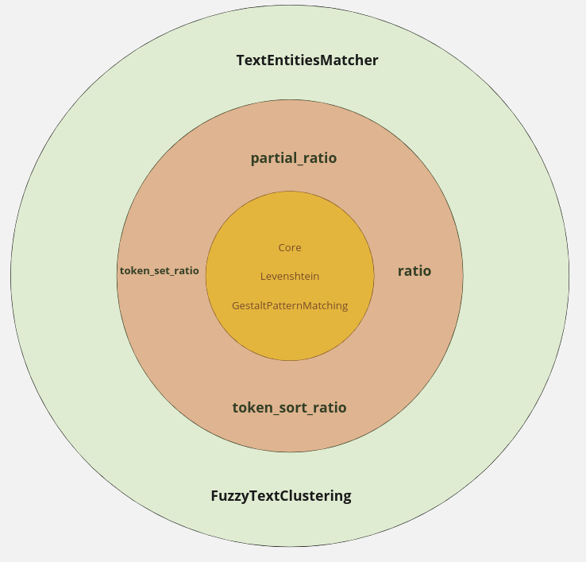
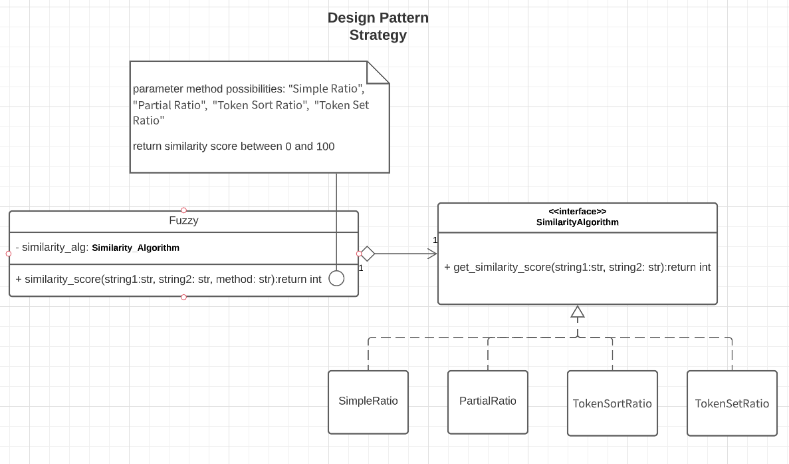

# About

The purpose of this project is to implement in Cython different similarity evaluation algorithms (partial ratio, token sort ratio, etc.) between two strings (fuzzy matching), returning a score that ranges from zero to 100, where zero indicates "not similar" and 100 "completely similar".

We do not intend to add third-party libraries, we will implement all relevant algorithms for this project (Levenshtein Distance, Gestalt pattern matching, etc.).

Additionally, we want to add a layer (in green in the figure below) with different applications for such algorithms.

Currently, we are in the phase of implementing the red layer, where the different similarity algorithms are strategies for the similarity calculation of the Fuzzy class.

I'm building this library on Saturdays and streaming it live on my twitch channel [CLovesPy](https://www.twitch.tv/clovespy).
